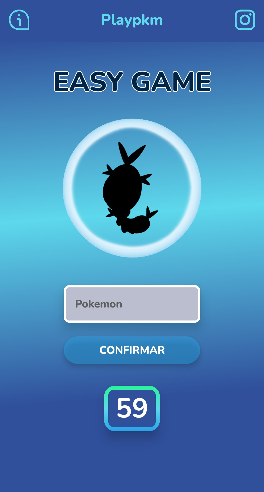
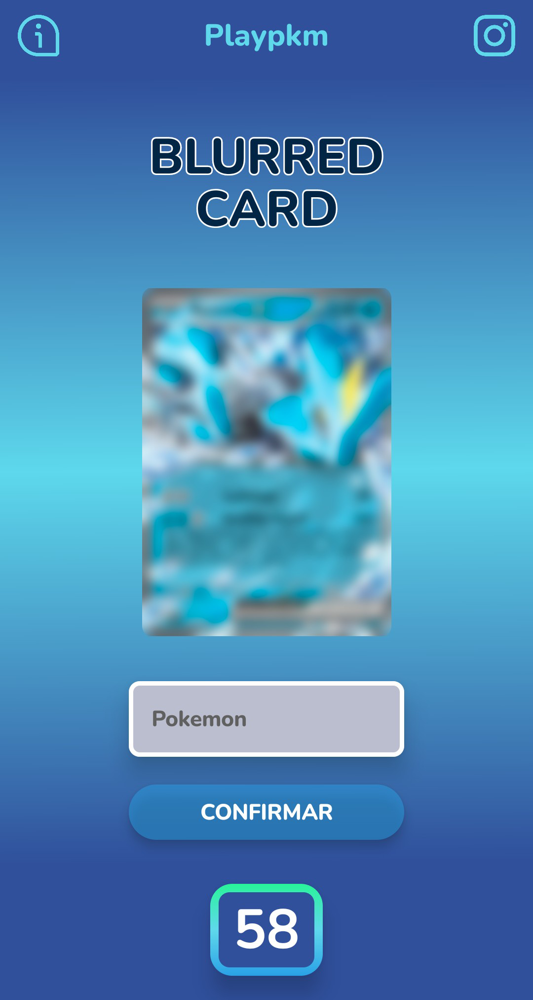
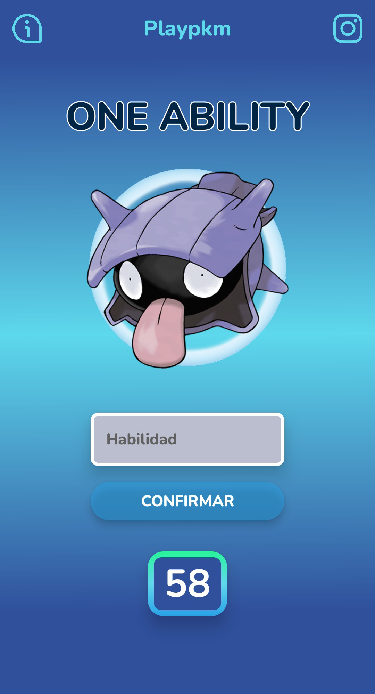
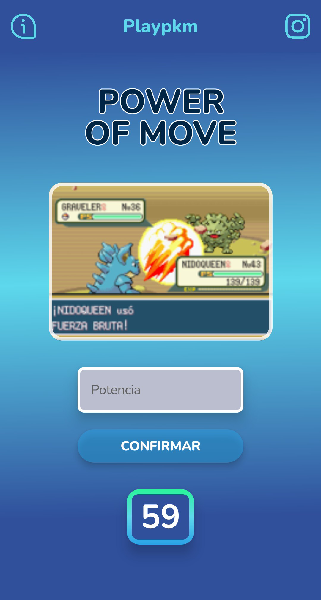
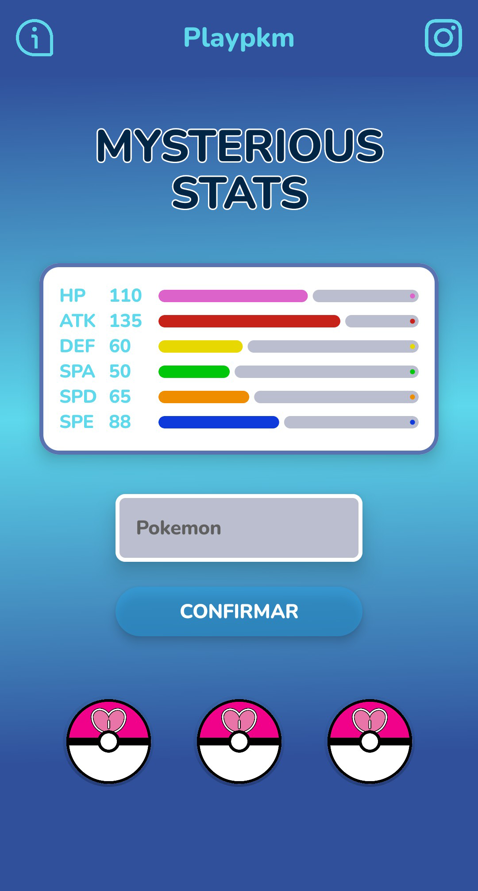
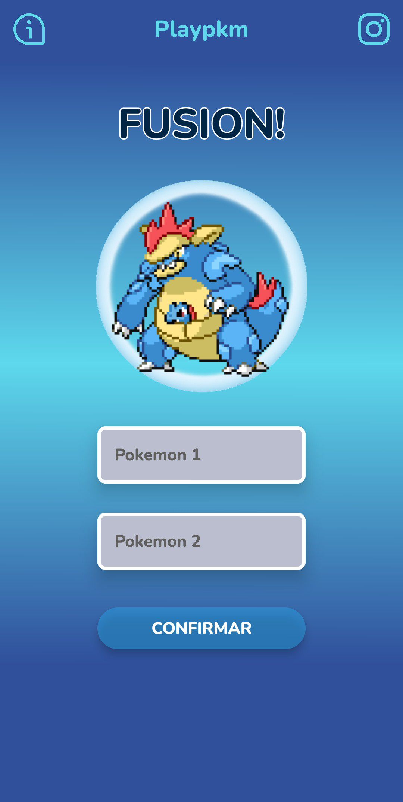

🎮 PlayPkm — ¡Demuestra cuánto sabes! 🏆

¡Compite, diviértete y escala en el ranking global!
PlayPkm te desafía con minijuegos diarios inspirados en nuestras criaturas favoritas.
Domina los 9 modos distintos, gana puntos y pone a prueba tus conocimientos. 🎮

Además, uno de los modos es ilimitado y jugable con amigos, ideal para ver quién es el verdadero maestro.
Podrás elegir tu criatura insignia entre una selección disponible… ¡pero elige con cuidado, no podrás cambiarla luego! 🫣

🎮 Minijuegos disponibles

🖤 ¿Quién está detrás de la silueta?

🔍 ¿Quién aparece en la carta desenfocada?

🧠 ¿Recuerdas alguna habilidad de esta criatura?

💥 ¿Cuál es la potencia del movimiento?

📊 ¿Quién se oculta detrás de las estadísticas?

🔀 Fusión misteriosa

…¡y muchos más que deberás descubrir!

🛠️ Tecnologías utilizadas

PlayPkm está desarrollado con un enfoque moderno basado en la arquitectura recomendada por Android:

👨‍💻 Frontend / UI

Jetpack Compose — Interfaz declarativa moderna.

State Management con ViewModels.

Navegación con Navigation Compose.

🏗️ Arquitectura

Inyección de dependencias con Hilt.

Estructura modular basada en buenas prácticas de Clean Architecture.

☁️ Backend y servicios

Firebase Authentication — Inicio de sesión por email.

Firestore — Base de datos en tiempo real para usuarios, rankings y estadísticas.

🗄️ Base de datos local

Room — Almacenamiento local para datos offline, progreso y configuraciones.

📷 Créditos de imágenes

Algunos minijuegos utilizan imágenes y recursos provenientes de:

PokéAPI — Datos oficiales públicos de Pokémon.

WikiDex — Enciclopedia con sprites, estadísticas e información (uso permitido con atribución).

Infinite Fusion Calculator — Imágenes generadas del proyecto Pokémon Infinite Fusion.

Las imágenes son utilizadas únicamente con fines ilustrativos, educativos y de juego casual dentro de la app.
Cada recurso pertenece a sus respectivos autores.

⚠️ Aviso legal

PlayPkm no es una aplicación oficial de Pokémon y no está afiliada, aprobada ni respaldada por Nintendo, GAME FREAK o The Pokémon Company.

Las imágenes e ilustraciones utilizadas son propiedad de sus respectivos autores.

© 2025 Pokémon. © 1995–2025 Nintendo/Creatures Inc./GAME FREAK inc.
Pokémon y los nombres de los personajes son marcas registradas de Nintendo.
